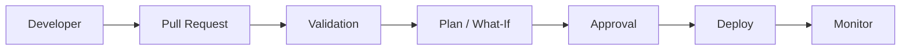

# Sample DevOps Flow

```mermaid
flowchart LR
    Dev[Developer] --> PR[Pull Request]
    PR --> CI[Validation]
    CI --> Plan[Plan / What-If]
    Plan --> Approval[Approval]
    Approval --> Deploy[Deploy]
    Deploy --> Monitor[Monitor]
```
